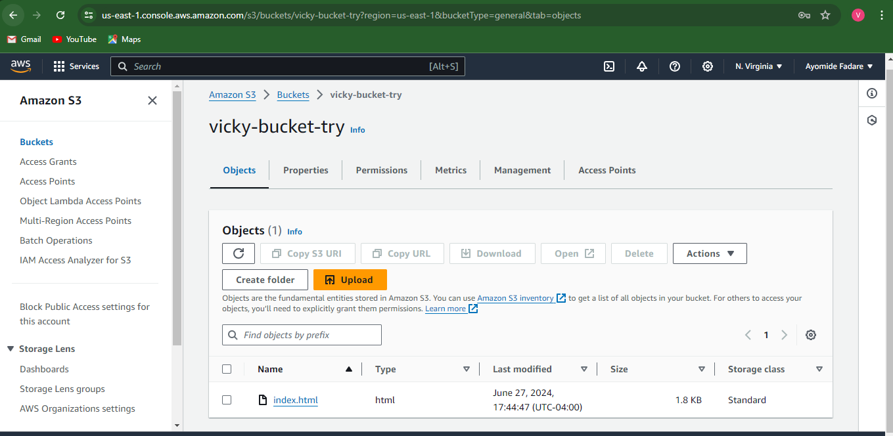
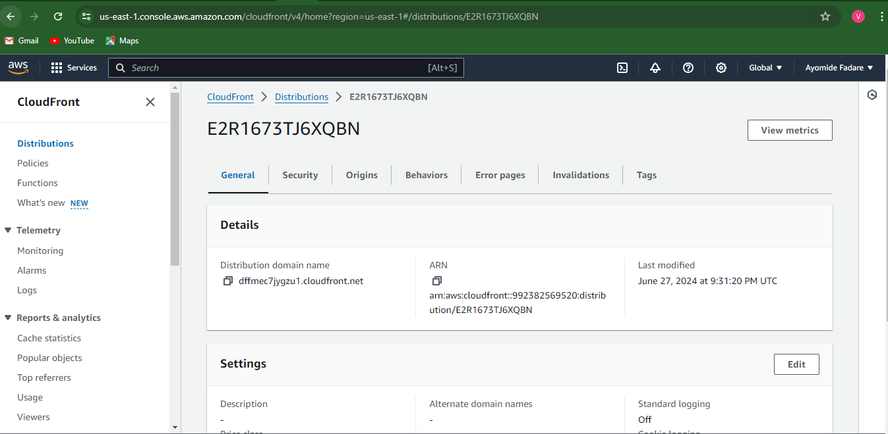
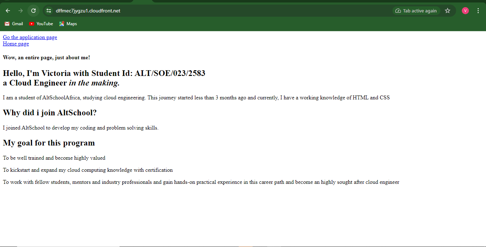
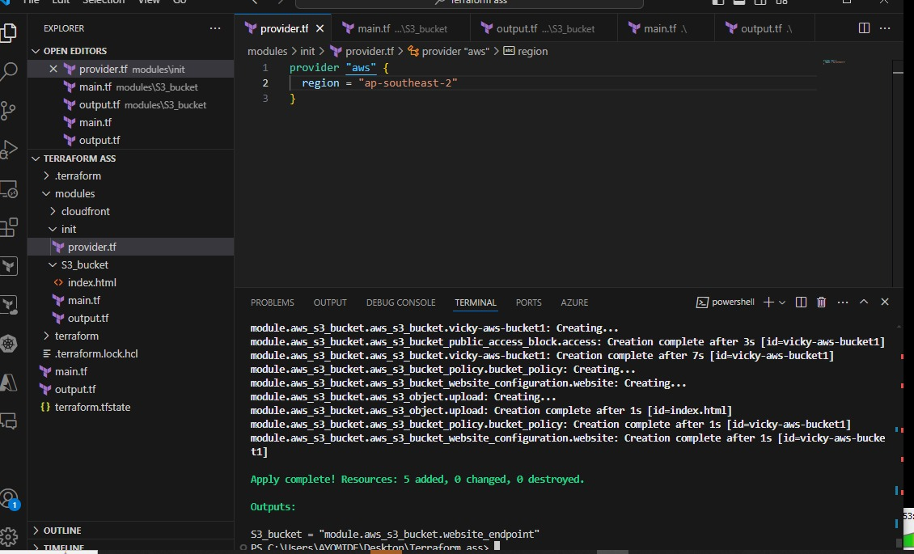

# Introduction
## This project deploys a static website using AWS S3, CloudFront, and Route 53 managed with Terraform.

### 1. The first thing i did was creat my S3 bucket made made sure to upload my website content in the root

### 2. Created my cloudfront distribution

### 4. Attach the policy to my s3 when creating my cloud front 

### 5. Went to my AWS console to check if cloud front can serve my page since i blocked public access on my s3-bucket, and it worked

### 6. After that i did terraform init to initilise terraform to my work directory

### After that i did terraform apply
